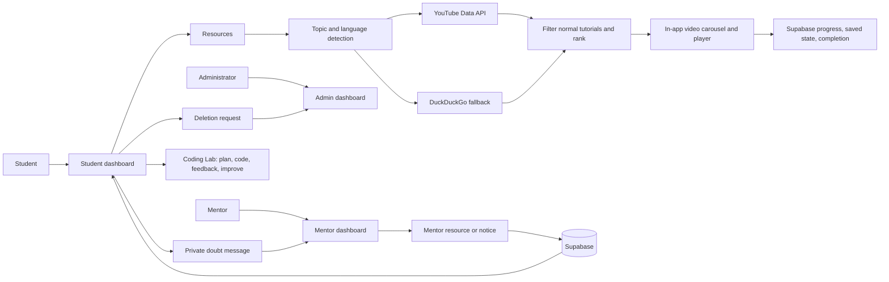

# HCL Intern Nexus

HCL Intern Nexus is a Streamlit internship learning portal with separate student, mentor, and administrator workspaces. It stores shared portal data in Supabase, so accounts, notices, doubts, meetings, resources, learning plans, and coding progress survive Streamlit Cloud restarts.

## What is included

- Student dashboard with notices, 24/7 mentor doubt text box, learning plan, meetings, resources, Formula Vault, Helping Bot, and a continuous Python Coding Lab.
- Mentor dashboard for student-specific meetings, private doubt replies, notices, resources, reports, and progress.
- Administrator dashboard for users, notices, and pending account-deletion requests.
- Focused Resources tab: normal YouTube lessons only (no Shorts), an in-app embedded player, playlist loading, horizontal lesson carousel, mentor suggestions, saved lessons, and persistent completion state.
- YouTube Data API search and playlist metadata when `YOUTUBE_API_KEY` is configured. DuckDuckGo is retained as a safe fallback.
- Deep-agent-inspired learning loops: the Resource workflow plans a query, detects language, filters/ranks results, and tracks learning state; the Coding Lab guides students through plan → write → check → hint → improve → next question. The practice sequence continues beyond 50 questions.

## Portal flow



## Persistent Supabase database

This release does **not** use SQLite. The database adapter uses the Supabase Data API and needs these two Streamlit secrets:

```toml
SUPABASE_URL = "https://your-project.supabase.co"
SUPABASE_SECRET_KEY = "your-server-side-supabase-secret-key"
```

Before the first deployment, open **Supabase Dashboard → SQL Editor**, paste the contents of [`database/schema.sql`](database/schema.sql), and run it once. The script is safe to run again. It creates all required permanent tables, including users, activity, meetings, notices, resources, video state, private messages, coding attempts, and deletion requests.

Do not use a browser/public Supabase key for `SUPABASE_SECRET_KEY`, and never commit any secret to GitHub.

## Streamlit Cloud secrets

In Streamlit Community Cloud, open **App settings → Secrets** and add the following values (substitute your own; never put real keys in the repository):

```toml
SUPABASE_URL = "https://your-project.supabase.co"
SUPABASE_SECRET_KEY = "your-server-side-supabase-secret-key"
YOUTUBE_API_KEY = "your-youtube-data-api-v3-key"
GROQ_API_KEY = "your-groq-key"
GROQ_MODEL = "openai/gpt-oss-120b"
GROQ_TRANSCRIPTION_MODEL = "whisper-large-v3-turbo"
WEATHERMAP_API_KEY = "your-weather-key"
MENTOR_EMAIL = "mentor@example.com"
TEAMS_MEETING_LINK = "https://teams.microsoft.com/your-meeting"
INTERNSHIP_TITLE = "Gen AI Internship"
```

`YOUTUBE_API_KEY` enables reliable search cards and playlist titles/thumbnails. It must have **YouTube Data API v3** enabled in Google Cloud. If it is unavailable or quota-limited, Resources falls back to DuckDuckGo instead of crashing.

## Local run

```powershell
git clone https://github.com/ayeshamehreentech/HCL_INTERN_NEXUS.git
cd HCL_INTERN_NEXUS
py -m venv .venv
.\.venv\Scripts\Activate.ps1
python -m pip install -r requirements.txt
streamlit run app.py
```

## Deployment checklist

1. Run `database/schema.sql` in the target Supabase project once.
2. Set the Streamlit secrets above.
3. Deploy branch `main` with `app.py` as the entry point.
4. Reboot the Streamlit app after saving secrets.

## Validation

```powershell
py -3.13 -m py_compile app.py authentication.py database\connection.py
py -3.13 -m py_compile dashboards\student\dashboard.py dashboards\student\resources.py dashboards\student\coding_lab.py
```

## Security

Keys disclosed in chat, images, logs, or a commit should be rotated immediately. Use only the rotated values in Streamlit secrets; never add them to `.env`, source code, or the README.
