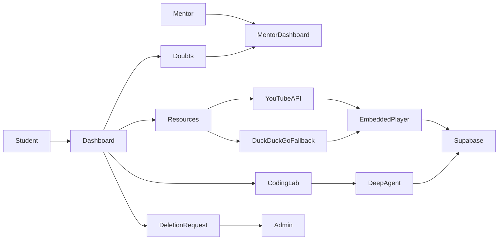

# HCL Intern Nexus

A Streamlit internship learning portal for students, mentors, and administrators. Portal data is stored permanently in Supabase.

## Included

- Student dashboard: Notices, 24/7 doubt messages, meetings, learning plans, Resources, Formula Vault, Helping Bot, and a continuous Python Coding Lab.
- Mentor workspace: student meetings, doubt replies, notices, resources, reports, and progress.
- Admin workspace: users, notices, and pending account-deletion requests.
- Focused Resources: normal YouTube lessons (no Shorts), embedded in-app player, playlist support, mentor suggestions, saved/completed state, and YouTube Data API search with DuckDuckGo fallback.
- LangChain Deep Agents: Coding Lab uses an agent loop to plan, inspect a student attempt, search for learning context, explain the next small step, and continue with fresh questions beyond 50 exercises.

## Flow



## Supabase (required)

This release does not use SQLite. In **Supabase Dashboard → SQL Editor**, run [database/schema.sql](database/schema.sql) once. It is safe to run again.

Set these in **Streamlit Cloud → App settings → Secrets** (use your current rotated values; never commit keys):

```toml
SUPABASE_URL = "https://your-project.supabase.co"
SUPABASE_SECRET_KEY = "your-current-server-side-secret-key"
YOUTUBE_API_KEY = "your-youtube-data-api-v3-key"
GROQ_API_KEY = "your-groq-key"
GROQ_MODEL = "openai/gpt-oss-120b"
MENTOR_EMAIL = "mentor@example.com"
TEAMS_MEETING_LINK = "https://teams.microsoft.com/your-meeting"
```

Use a current **server-side Supabase secret key**, not the public anon key. After saving Secrets, reboot the Streamlit app.

## Run locally

```powershell
py -m venv .venv
.\.venv\Scripts\Activate.ps1
python -m pip install -r requirements.txt
streamlit run app.py
```

## Security

Rotate any key exposed in chat, screenshots, logs, or commits. Keep all API keys only in Streamlit Secrets.
