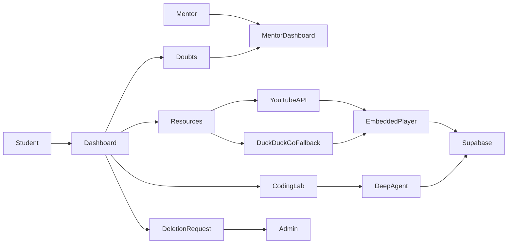
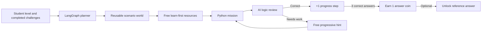

# HCL Intern Nexus

A Streamlit internship learning portal for students, mentors, and administrators. Portal data is stored permanently in Supabase.

## Included

- Student dashboard: Notices, 24/7 doubt messages, meetings, learning plans, Resources, Formula Vault, Helping Bot, and a continuous Python Coding Lab.
- Mentor workspace: student meetings, doubt replies, notices, resources, reports, and progress.
- Admin workspace: users, notices, and pending account-deletion requests.
- Focused Resources: normal YouTube lessons (no Shorts), embedded in-app player, playlist support, mentor suggestions, saved/completed state, and YouTube Data API search with DuckDuckGo fallback.
- LangChain Deep Agents: Coding Lab uses an agent loop to plan, inspect a student attempt, search for learning context, explain the next small step, and continue with fresh questions beyond 50 exercises.
- Python Quest Coding Lab: an adaptive game journey maps Python topics to reusable worlds such as Castle Gate (conditions), Fuel Station (loops), Treasure Chest (lists), Robot Repair (functions), AI Lab (OOP), and Cyber Lock (advanced Python).
- Helping Bot memory: each student's chat history, chosen teaching persona, response temperature, working-context snapshot, and readable summary are saved privately and permanently in Supabase.

## Flow



## Python Quest Coding Lab

Each challenge is generated by the LangGraph planning flow, not chosen from a small fixed question list:



- A student sees free IBM SkillsBuild, Cisco Networking Academy, and official Python documentation links before opening a task.
- Every distinct verified answer fills one of three coin-progress steps.
- Three verified answers earn one coin; coins unlock a full reference answer only when the student chooses to spend one. Hints remain free.
- Scenarios are reusable, so a Castle Gate can begin with one condition and later grow into multi-condition or multi-room logic.

## Helping Bot persistence

Helping Bot stores all student-specific data in Supabase. The right-hand control panel lets a student start a new chat, browse prior chats, set response temperature, and save a persona prompt such as “Act like a supportive mentor and explain each step simply.”

- **Working memory:** a permanent snapshot of the last six prompt-context messages after each reply.
- **Episodic memory:** prior private chats, grouped by new-chat boundaries.
- **Summary memory:** a permanent readable summary saved after every reply.

The app labels these records honestly: only the saved snapshots are durable; the model receives only the selected chat context at reply time.

## Supabase (required)

This release does not use SQLite. In **Supabase Dashboard → SQL Editor**, run [database/schema.sql](database/schema.sql) once. It is safe to run again.

Set these in **Streamlit Cloud → App settings → Secrets** (use your current rotated values; never commit keys):

```toml
SUPABASE_URL = "https://your-project.supabase.co"
SUPABASE_SECRET_KEY = "your-current-server-side-secret-key"
YOUTUBE_API_KEY = "your-youtube-data-api-v3-key"
GROQ_API_KEY = "your-groq-key"
GROQ_MODEL = "openai/gpt-oss-120b"
MENTOR_EMAIL = "mentor@example.com"
TEAMS_MEETING_LINK = "https://teams.microsoft.com/your-meeting"
```

Use a current **server-side Supabase secret key**, not the public anon key. After saving Secrets, reboot the Streamlit app.

## Run locally

```powershell
py -m venv .venv
.\.venv\Scripts\Activate.ps1
python -m pip install -r requirements.txt
streamlit run app.py
```

## Security

Rotate any key exposed in chat, screenshots, logs, or commits. Keep all API keys only in Streamlit Secrets.


## Production Docker deployment

The application image is stateless. Supabase remains the external, permanent database; it is intentionally not run inside the application container.

1. Copy the secret template: `cp .env.example .env` (Windows PowerShell: `Copy-Item .env.example .env`).
2. Put your current production keys in `.env`. Do not commit this file.
3. Start the service: `docker compose up --build -d`.
4. Open `http://localhost:8501` (or set `HOST_PORT` before starting).
5. Inspect service output: `docker compose logs -f app`.
6. Stop it: `docker compose down`.

The Docker image runs Streamlit as a non-root user, exposes only port 8501, includes an HTTP health check, and restarts automatically unless stopped.
