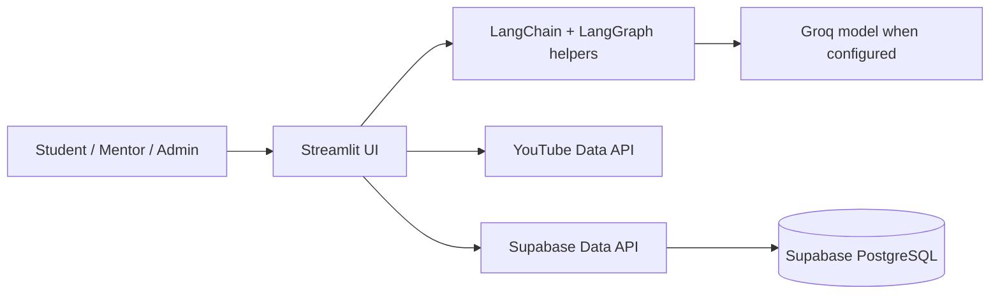
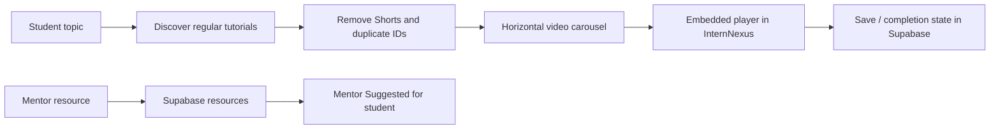

# HCL Intern Nexus

**InternNexus** is an AI-powered internship management and learning platform developed during an HCLTech internship. It provides separate student, mentor, and administrator workspaces in a single Streamlit application.

All shared portal data is stored in **Supabase PostgreSQL** through the Supabase Data API. The app does not use a local SQLite database, so accounts, notices, resources, doubts, meetings, plans, coding attempts, and Helping Bot history survive Streamlit Cloud restarts.

## Core capabilities

- Student, mentor, and administrator account workflows
- Permanent notices, private doubts, mentor learning resources, and account-deletion requests
- Mentor meeting scheduling and recurring Tuesday/Thursday meetings
- In-app YouTube learning: search, playlist loading, filtered regular tutorials, horizontal carousel, embedded `youtube-nocookie` player, saved items and completion state
- Mentor resources are visible in the student's **Mentor Suggested** section
- Python Quest Coding Lab: an interactive HTML/CSS/JavaScript Home/Map/Levels mini-game, staged scenario worlds, learn-before-code lessons, attempts, completion progress, and coins earned after verified answers
- Helping Bot with per-student permanent chat history, persona preferences, working memory and summary memory; retrieval-augmented answers grounded in permanent notices and mentor resources
- PyQuest uses a validated Python event registry: LangGraph/Python selects an allowlisted event, then the embedded JavaScript runs only predefined scene animations (never AI-generated browser code)
- LangChain/LangGraph-oriented deep-agent utilities for Coding Lab and HCL content workflows, with safe fallbacks when an AI provider is unavailable
- Responsive brown/beige light and dark visual theme

## Architecture



### Resource learning flow



## Supabase setup

1. In the Supabase dashboard, open **SQL Editor**.
2. Run [`database/schema.sql`](database/schema.sql).
3. Also run [`database/helping_bot_schema.sql`](database/helping_bot_schema.sql) for permanent Helping Bot profiles and memory snapshots.
4. In Streamlit Cloud, configure secrets using your own rotated values:

```toml
SUPABASE_URL = "https://your-project.supabase.co"
SUPABASE_SECRET_KEY = "your-server-side-secret-key"
YOUTUBE_API_KEY = "your-youtube-data-api-key"
GROQ_API_KEY = "optional"
GROQ_MODEL = "optional-model-name"
WEATHERMAP_API_KEY = "optional"
MENTOR_EMAIL = "mentor@example.com"
TEAMS_MEETING_LINK = "https://teams.microsoft.com/..."
INTERNSHIP_TITLE = "Gen AI Internship"
```

Never commit secrets, database passwords, or API keys. Rotate any value that has been displayed in a chat, image, terminal log, or commit history.

## Run locally

```powershell
git clone https://github.com/ayeshamehreentech/HCL_INTERN_NEXUS.git
cd HCL_INTERN_NEXUS
py -m venv .venv
.\.venv\Scripts\Activate.ps1
python -m pip install -r requirements.txt
streamlit run app.py
```

Add the required variables to `.streamlit/secrets.toml` locally. Do not add that file to Git.

## Streamlit Cloud deployment checklist

1. Push the merged `main` branch to GitHub.
2. Confirm the app points at that repository and branch.
3. Add the secrets listed above in **App settings → Secrets**.
4. Reboot the app after changing secrets or schema.
5. If Supabase reports a missing table or column, re-run both schema files in the SQL Editor.

## Validation checklist

- Create a student account and confirm it remains available after a reboot.
- Create a notice, resource, doubt, and meeting as mentor; verify the student sees each item.
- Search a video topic and play a result inside the Resources tab.
- Complete a Python Quest task and verify progress/coin state updates.
- Send a Helping Bot message, reload the application, and confirm history remains.

## Security

Keep privileged Supabase keys only in Streamlit secrets. Use the least-privileged key compatible with your Row Level Security policy, and restrict any browser-exposed API keys in their provider dashboard.
